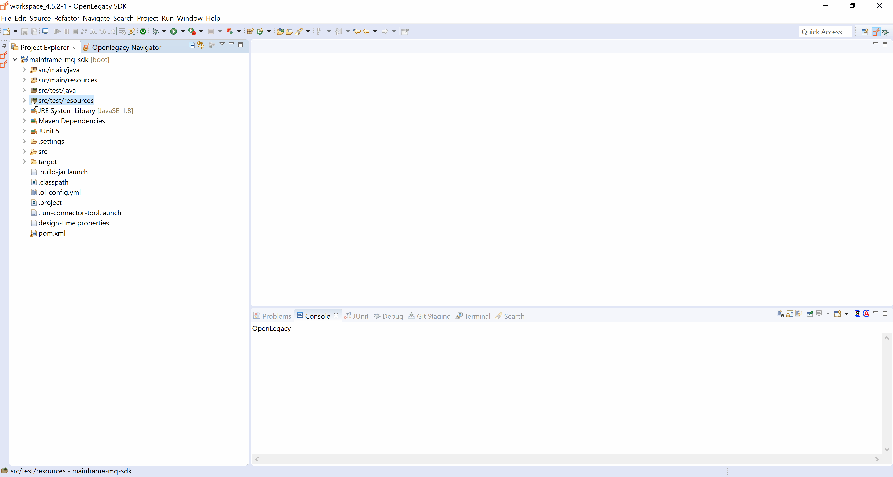

# Expose AS/400 COBOL Program as REST API

## Introduction

This demo shows generation of Java models from **AS/400 RPC Cobol** sources using OpenLegacy IDE, and exposure via **REST API**.

## Architecture


## Pre-Requirements

- OpenLegacy IDE 4.6.10 (Full installation including JDK and all Maven dependencies)
- Internet Connection

## Demo Definition

- Creation of a new SDK Project.
- Generation of Java Entities using OpenLegacy's built in **Cobol Parser**.
- Develop and run unit tests on the fly.
- Test the connectivity and data retrieval from **AS/400 Machine**.
- Creation of an API Project on the top of your SDK Project.

## Demo Resources

- [ItemDetails.cbl](./assets/resources/ItemDetails.cbl)

## Step 1 – Create a New SDK Project

> First, we will create a new SDK project using OpenLegacy IDE.
The purpose of the SDK project is to allow easy access to legacy backends, using standard and easy to use Java code.

1. Open the New Project Wizard:
   - File → New → OpenLegacy SDK Project
2. Define the **Project Name** as `as400-cobol-rpc-sdk`.
3. Click at the **Default Package** field, to automatically fill it up.
4. Select **AS/400 RPC** as the backend and click Next.
5. Set the connection details to the backend based on following parameters:
   - **Host Name/IP:** `as400.openlegacy.com`
   - **Code Page:** `37`
   - **Username:** `OPENLEGA1`
   - **Password:** `OPENLEGA`
6. Click **Finish**.


## Step 2 – Generate Java Model (Entity) from the COBOL File

> Now, we will create Java models out of a COBOL source file of the program we wish to expose.

1. Open `ItemDetails.cbl` located at `src/main/resources/sample` folder.
2. Right click on the file → OpenLegacy → Generate Model.
3. In the **Execute Action Path** field, write `/QSYS.LIB/RMR2L1.LIB/FULLDETAIL.PGM`.
4. Check **Generate JUnit Test** checkbox.
5. Click **OK**.


## Step 3 – Create a JUnit Test

> OpenLegacy enables test-driven development by auto-generating test suites for each backend program (entities).
> We can extend this test suite with additional unit tests to validate our connectivity to the backend.
> The tests are auto-generated, and all you have to do is to provide a JSON format input and output to test againt the backend.

1. Open `src/test/resources/mock/ItemdetailsTest/test_itemdetailsTest_usecase_1.input.json` and change the itemNum field to `1000`, this will be the input.
2. Open `src/test/resources/mock/ItemdetailsTest/test_itemdetailsTest_usecase_1.output.json` and paste the following JSON, this is the expected output:
     ```json
     {
       "itemNum" : 1000,
       "itemRecord" : {
         "itemName" : "Kid Guitar",
         "description" : "Kids Guitar - Musical Toys",
         "weight" : 200
       },
       "shipping" : {
         "shippingMethod" : "AIR MAIL",
         "days" : 2
       }
     }
     ```
3. Open `src/test/resources/mock/ItemdetailsTest/test_itemdetailsTest_usecase_2.input.json` and change the itemNum field to `1004`, this will be the input.
4. Open `src/test/resources/mock/ItemdetailsTest/test_itemdetailsTest_usecase_2.output.json` and paste the following JSON, this is the expected output:
     ```json
       {
         "itemNum" : 1004,
         "itemRecord" : {
           "itemName" : "Pig Bank",
           "description" : "Pig Saving Bank - Ceramics",
           "weight" : 5000
         },
         "shipping" : {
           "shippingMethod" : "AIR MAIL",
           "days" : 2
         }
       }

     ```
3. Run the JUnit by Right Clicking on `testItemdeEXECUTE` → Run As → JUnit Tests.
   If you followed all the steps correctly the tests should pass.



## Step 4 – Create API from SDK

1. Open the New Project Wizard:
   - File → New → OpenLegacy API Project
2. Define the project name as `as400-cobol-rpc-api`.
3. Click at the **Default Package** field, to automatically fill it up.
4. Press Next and add the SDK project that was created in **Step 1**  as the reference project.
5. **Right-Click** on the **as400-cobol-rpc-api** project → OpenLegacy → Generate API from SDK
    - Name the service `ItemDetails`.
    - Select from the `ItemDetails` model the `itemNum` as input and change its name to `itemNumber` for better readability.
    - Select `ItemDetails` model as output.
    - **Click OK**


## Step 5 - Run and Test your API

1. **Right-Click** on the **as400-cobol-rpc-api** project → OpenLegacy → Run Application
2. Open the browser on http://localhost:8080/swagger
3. Authorize through **Oauth2**
   - **Client Id:** `client_id`
   - **Client Secret:** `client_secret`
4. **Click** on the API we've created → Try it out
   - Set dummy item Number as input (for example: `1000`).
   - You should see successful respond returned directly from the AS/400 program `FULLDETAIL`!.
     ```json
     {
       "itemdetails": {
         "itemNum": 1000,
         "itemRecord": {
           "itemName": "Kid Guitar",
           "description": "Kids Guitar - Musical Toys",
           "weight": 200
         },
         "shipping": {
           "shippingMethod": "AIR MAIL",
           "days": 2
         }
       }
     }
     ```


## Summary

In this demo we have presented an end to end integration with **AS/400 RPC** using Openlegacy IDE within just a couple of minutes. We have started from a COBOL source of a program we wanted to expose and automatically generated Java SDK that enables calling the underlying program, then we have presented the creation of a REST API utilizing the AS/400 RPC SDK.
We used the IDE to better model and design the API and showed how it works with a standard Swagger page.
