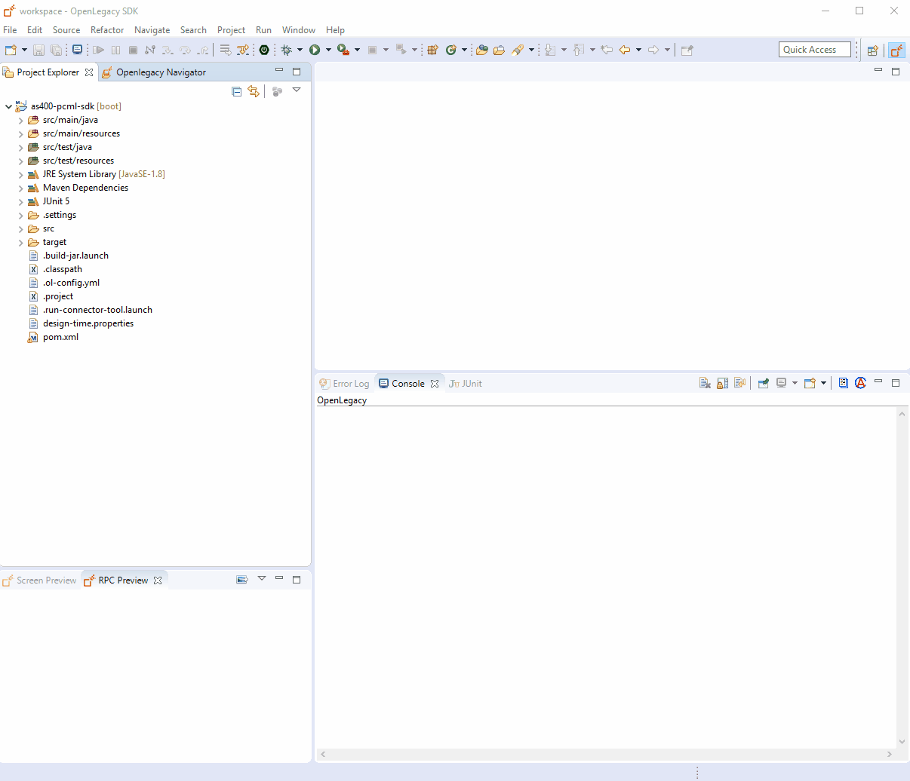

# AS/400 RPC Using PCML
## Intro
Fetch metadata used for pulling the information from inside the AS400 filesystem for easy display of its content.

## Pre-Requirements

- OpenLegacy IDE  (Full installation including JDK and all Maven dependencies)
- Internet Connection

## Demo Definition

- Create a new SDK Project.
- Generate Java model (Entity) from Pcml source file.
- Develop unit tests on the fly.
- Test the connectivity and data retrieval from the **AS400**.
- You will use JUnit tests to test the SDK and invoke the response.
- Creation of an API Project on the top of your SDK Project.

## Step By Step

## Step 1 - Create New SDK Project:
First, we will create a new SDK project using OpenLegacy IDE. The purpose of the SDK project is to allow easy 		
access to legacy backends, using standard and easy to use Java code.

Create a new OpenLegacy AS/400 RPC project:
1.  Open the New Project Wizard:
    -  File → New → OpenLegacy SDK Project
2.  Define the project name and the default package
3.  Select AS/400 RPC as the backend and click Next
4.  Enter the following AS/400 host credentials:
    -   Host Name/IP: OPENLEG.RZKH.DE
    -   Code Page: 37
    -   User name: `OPENLEGA1`
    -   Password: `OPENLEGA`


## Step 2 - Fetch Program Metadata:
1. Right click on the project -> Fetch Program Metadata 
2. Fill in the Program Path filed the requested program, eg:  
`/QSYS.LIB/OPENLEGA11.LIB/GETCST.PGM`
   
  Alternatively, if you don't sure what is the program path, you can browse between all the programs by:  
  Right click on the project -> Explore AS/400 Sources.

3. Click on Test Connection
   
   
   
## Step 3 - Generate Java Model (Entity) from the PCML File:
1. Open the PCML file located at `src/main/resources/legacy` folder.
2. Right click on the file → OpenLegacy → Generate Model
3. In the **Execute Action Path** field, write the path of the pcml program, eg: `/QSYS.LIB/OPENLEGA11.LIB/GETCST.PGM`
4. Check **Generate JUnit Test** checkbox
5. Click OK



## Step 4 - Run JUnit test:
1. Go to `/src/test/resources/mock/GetcstTest/test_getcstTest_usecase_1.input.json`
2. Set The customer id to: `0001`  
It should look  like:

      ```json
      {
         "customerid" : "0001",
         "firstname" : "",
         "lastname" : "",
         "address" : "",
         "credit" : "",
         "discount" : 0,
         "balance" : 0,
         "phone" : "",
         "status" : ""
      }
      ```

3. Go to `/src/test/resources/mock/GetcstTest/test_getcstTest_usecase_1.output.json` and set:
   
   ```json
   {
      "customerid" : "0001",
      "firstname" : "Annie",
      "lastname" : "OAKLEY",
      "address" : "00001 Ave. ABC",
      "credit" : "GC",
      "discount" : 0.114,
      "balance" : 1315.05,
      "phone" : "6789012078912345",
      "status" : "OK"
   } 
   ```

4. Go to `/src/test/java/tests/GetcstTest.java` 
5. Run the JUnit by Right Clicking on GetcstTest.java → Run As → JUnit Tests.


## Step 5 - Create New API Project:
Create a new OpenLegacy API project:
1. Open the New Project Wizard:  
   - File → New → OpenLegacy API Project
2. Define the project name and the default package
3. Select REST API as the Service Type
4. Click Next
5. Select the Java SDK Project you created before.
6. Click Finish


## Step 6 - Create a Service:
1. Right click the project → OpenLegacy → Generate API from SDK
2. Enter the service name
3. From the Java SDK you created in previous exercise, select the input and output fields. for example:  
   - Input - `as400-pcml-sdk` -> `Getcst` -> `customerid`
   - Output - `as400-pcml-sdk` -> `Getcst`
4. Click **OK**


## Step 7 - Test API using Swagger UI:

1. Right click the project → OpenLegacy → Run Application → OK
2. Open the Swagger page (http://localhost:8080/swagger)
3. Authorize through **Oauth2**
   - **Client Id:** `client_id`
   - **Client Secret:** `client_secret`
4. Click Try it out and insert:  
  **customerid:** `0001`

 The page should display the results following results:

    {
      "customerid" : "0001",
      "firstname" : "Annie",
      "lastname" : "OAKLEY",
      "address" : "00001 Ave. ABC",
      "credit" : "GC",
      "discount" : 0.114,
      "balance" : 1315.05,
      "phone" : "6789012078912345",
      "status" : "OK"
    } 


## Summary

In this demo, we have presented an end to end integration with AS400 using Openlegacy IDE within just a couple of minutes. We have started from a PCML source of a program we wanted to expose and automatically generated Java SDK that enables calling the underlying program, then we have presented the creation of a REST API utilizing the AS400 SDK. We used the IDE to better model and design the API and showed how it works with a standard Swagger page.

