# REST API on top of AS/400 Screens SDK

## Introduction

AS/400 Screens integration demo shows how we can take green screens applications, and expose business flows of these applications as APIs.
This document will guide you on how to achieve this using the OpenLegacy IDE.

## Architecture


## Pre-Requirements

- OpenLegacy IDE version 4.6.12 (Full installation including JDK and all Maven dependencies)
- Internet Connection

## Demo Definition

- Create a new SDK Project.
- Record a trail file using OpenLegacy Screens Emulator.
- Generate Java models (Screen Entities) from a trail file.
- Define screens navigation to automate the flow between screen in run-time.
- Develop unit tests on the fly.
- Test the connectivity and data retrieval from the AS/400 host.
- You will use JUnit tests to test the SDK and invoke the response.
- Creation of an API Project on the top of your SDK Project.
- Test of the API Project through Swagger definition.

## Step 1 – Create a New SDK Project

> First we will create a new SDK project using the OpenLegacy IDE.
The purpose of the SDK project is to allow easy access to legacy backends, using standard and easy to use Java code.

1. Open the New Project Wizard:
   - File → New → OpenLegacy SDK Project
2. Define the **Project Name** as `as400-5250-sdk`.
3. Click at the **Default Package** field, to automatically fill it up.
4. Select **AS/400 Screens** as the backend and click Next
5. Enter the AS/400 information:
   - **Host Name/IP:** `as400.openlegacy.com`
   - **Host Port:** `23`
   - **Code Page:** `37`
   - **User name:** `OPENLEGA1`
   - **Password:** `OPENLEGA`
6. Click **Finish**

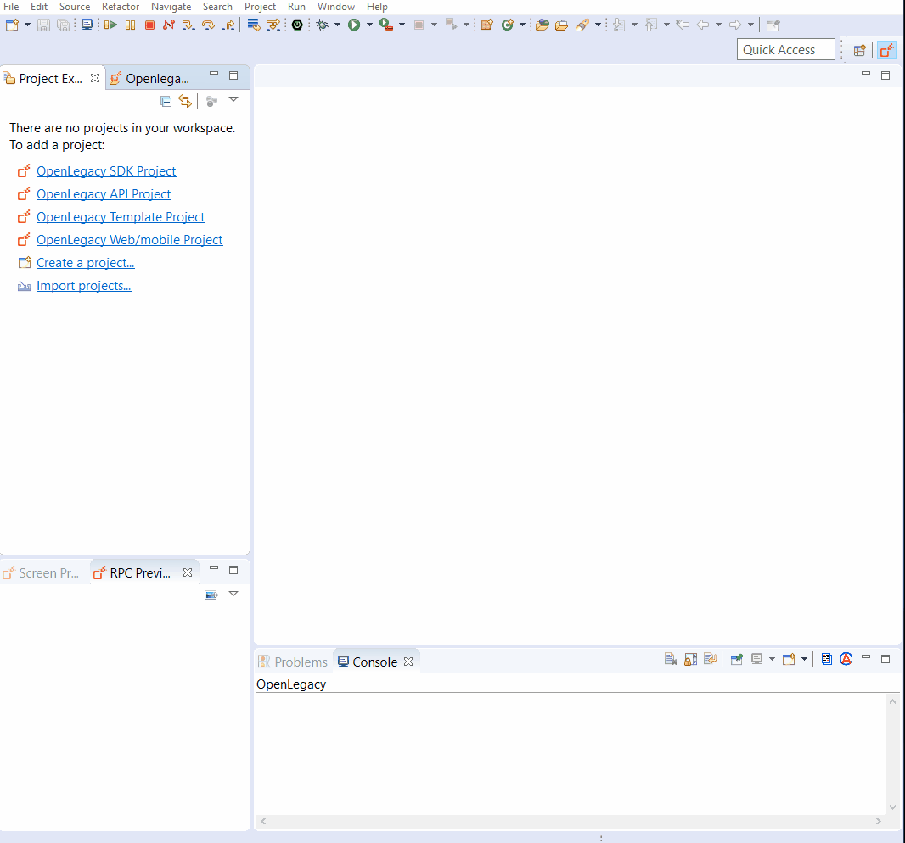

## Step 2 - Add setting.xml to your .m2 repository

1. **Add a file named settings.xml** to the maven folder **(user_home/.m2/settings.xml)** or if you already have it, 
add the missing configuration as follows:

    <details>
    <summary> Click to see the settings.xml</summary>  
    
      ```xml
           <settings xsi:schemaLocation="http://maven. apache.org/SETTINGS/1.1.0 http://maven. apache.org/xsd/settings-1.1.0.xsd"
                     xmlns="http://maven.apache.org/ SETTINGS/1.1.0"
                     xmlns:xsi="http://www.w3.org/2001/ XMLSchema-instance">
               <servers>
                   <server>
                       <id>ol-3rd-party-libs</id>
                       <username>public</username>
                       <password>AP3UUPpoUv5HMRpNWwEXHK remER</password>
                   </server>
                   <server>
                       <id>openlegacy-m2</id>
                       <username>public</username>
                       <password>AP3UUPpoUv5HMRpNWwEXHK remER</password>
                   </server>
               </servers>
               <profiles>
                   <profile>
                       <id>def</id>
                       <repositories>
                           <repository>
                               <id>openlegacy-m2</id>
                               <url>https://openlegacy. jfrog.io/openlegacy/ ol-public</url>
                           </repository>
                           <repository>
                               <id>ol-3rd-party-libs</id>
                               <url>https://openlegacy. jfrog.io/openlegacy/ ol-3rd-party-libs</url>
                           </repository>
                       </repositories>
                   </profile>
               </profiles>
               <activeProfiles>
                   <activeProfile>def</activeProfile>
               </activeProfiles>
           </settings>
    ``` 
    
     </details>

2. Right-click on the SDK project → Run As → Maven Install  
   Maven Install will find and download the necessary jars.  
  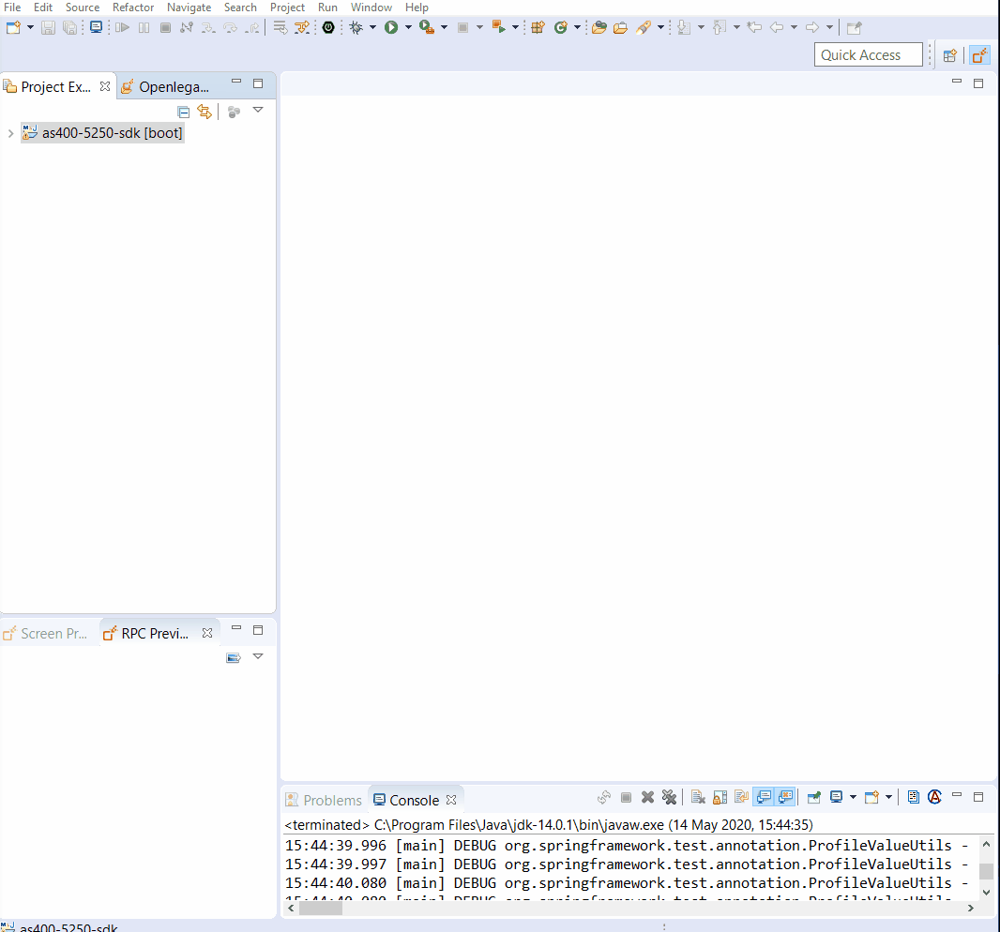   
   
## Step 3 – Record a Trail File Using OpenLegacy Screens Emulator

> In this step we will record the screens flow - the result will be a trail file.
The Trail file has two purposes:

- The Trail file is a resource required when generating the entities, it contains all the metadata required to accurately describe the legacy screens to allow the creation of the Java models that will be used in the live application
- The Trail file is a replication of the real host screens that can be used as a mock-up to run the project for testing or other purposes, without connecting to the live host

1. Right click on the SDK project→ OpenLegacy → Run emulation

   > **_NOTE:_** This will open up a terminal connection to the host that can be accessed at http://localhost:1512 via a web browser

2. Press `Enter` on the following screen after entering the following credentials:

   - **User:** `OPENLEGA1`
   - **Password:** `OPENLEGA`
   
    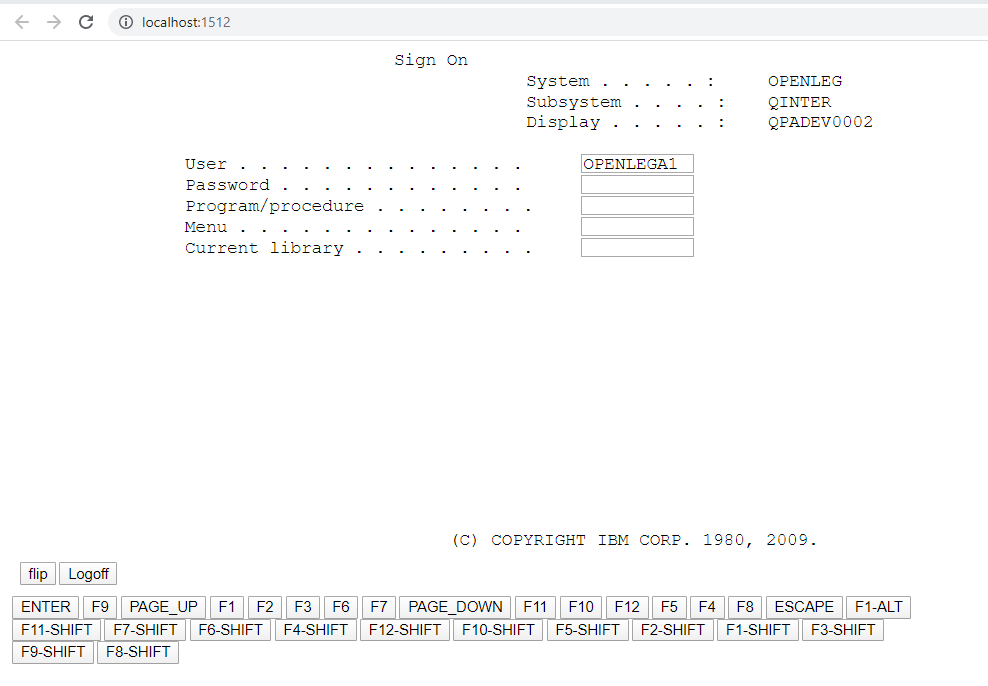
    
3. On the following screen, type `1` in the `Selection or Command` field and press `Enter`:

   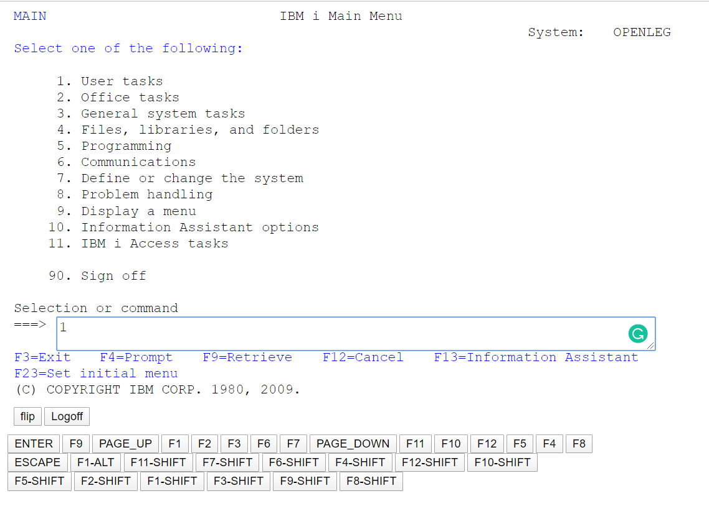
      
 4. On the next screen, repeat the step from above.
   
    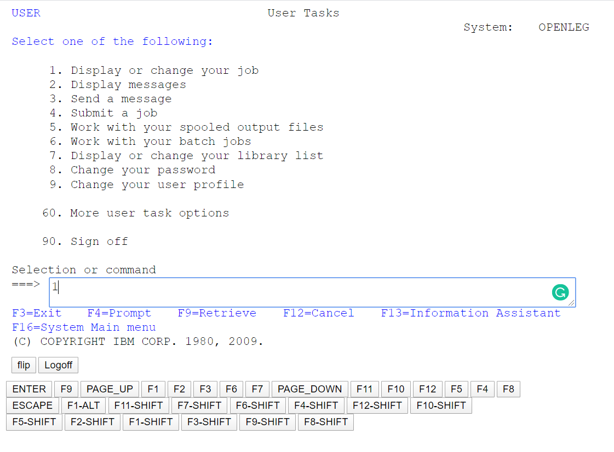
    
 5. On the following screen, type `3` in the `Selection or Command` field and press `Enter`:
   
    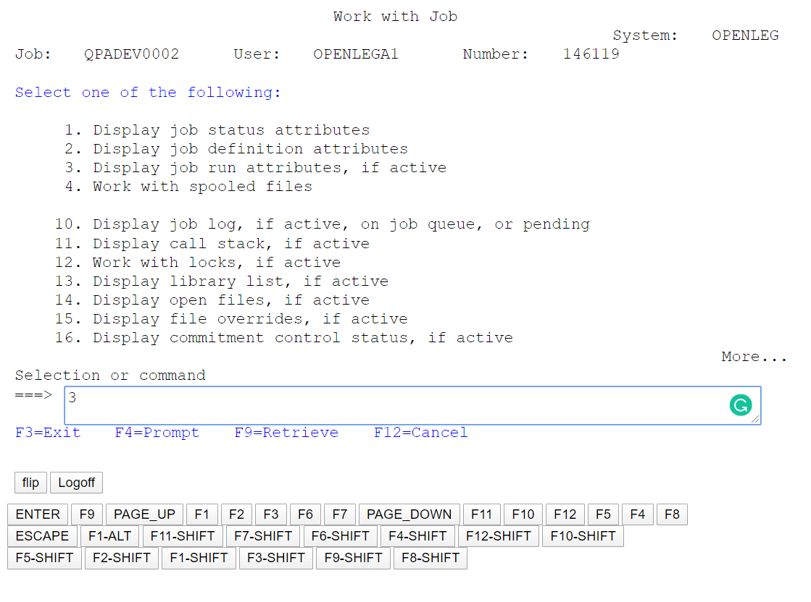
    
    
6. Once you see the following screen below, click on `Logoff`.

   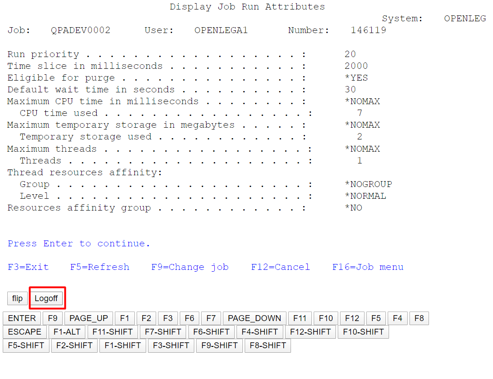
   
## Step 4 – Generate Java Models From a Trail File

> In this step we will create our Java models from the recorded trail file.

> **_NOTE:_** If a popup already appears, skip steps 1-3
1. Go back to the OpenLegacy IDE
2. Right click on the `as400-5250-sdk` project → Refresh
3. A popup window will appear:

   

4. Click **Yes**.
5. Another popup window will appear:

   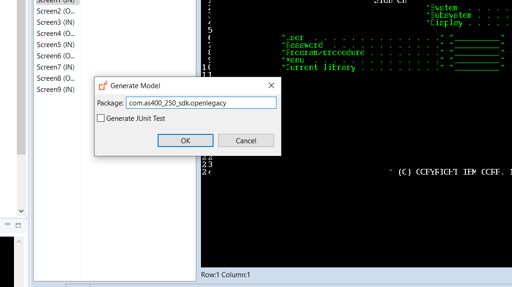

   Check `Generate JUnit Test` and click **OK**

6. Screen entities are Plain Java Objects that are used as models for the terminal screens.

    Each screen entity is defined by three properties:

- Identifiers - Contains the unique properties of the screen which differentiate it from other screens, and allow to identify it.
- Navigation - Contains metadata about how to navigate to this screen.
- Fields - Creates the relationship between the Java field to the exact position the field is located on the terminal screen.
 In this step we are going to define our screen entities, their fields and Identifiers.
> You may see that most of the process is well automated, we do recommend to review the screen entities and make sure that we use unique **Identifiers** for the newly created entities. 

- After each window click **OK** to approve the generated screen. 
 
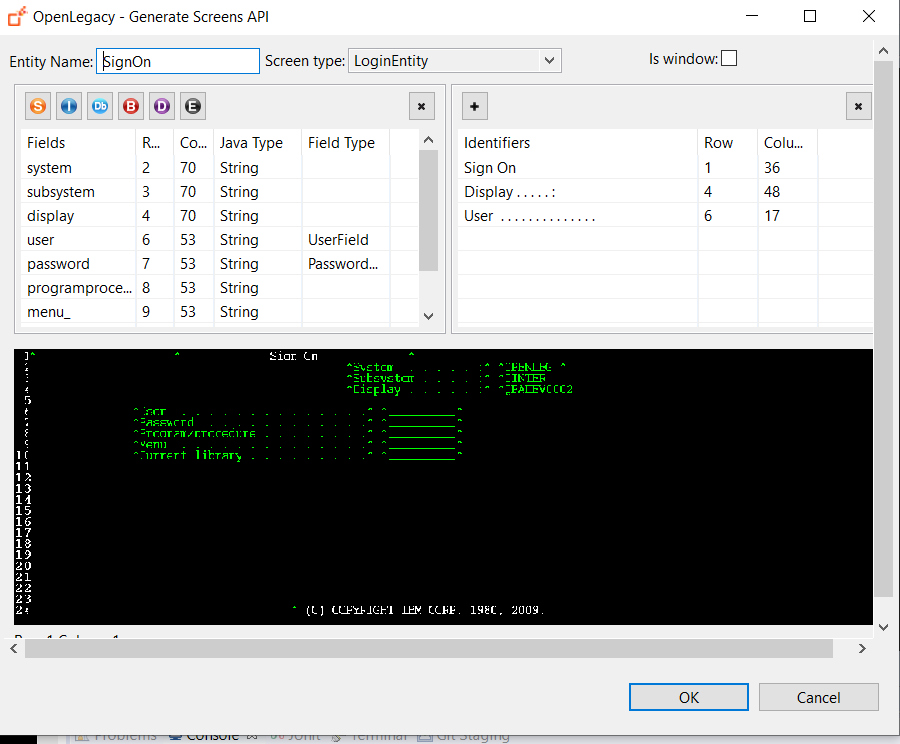

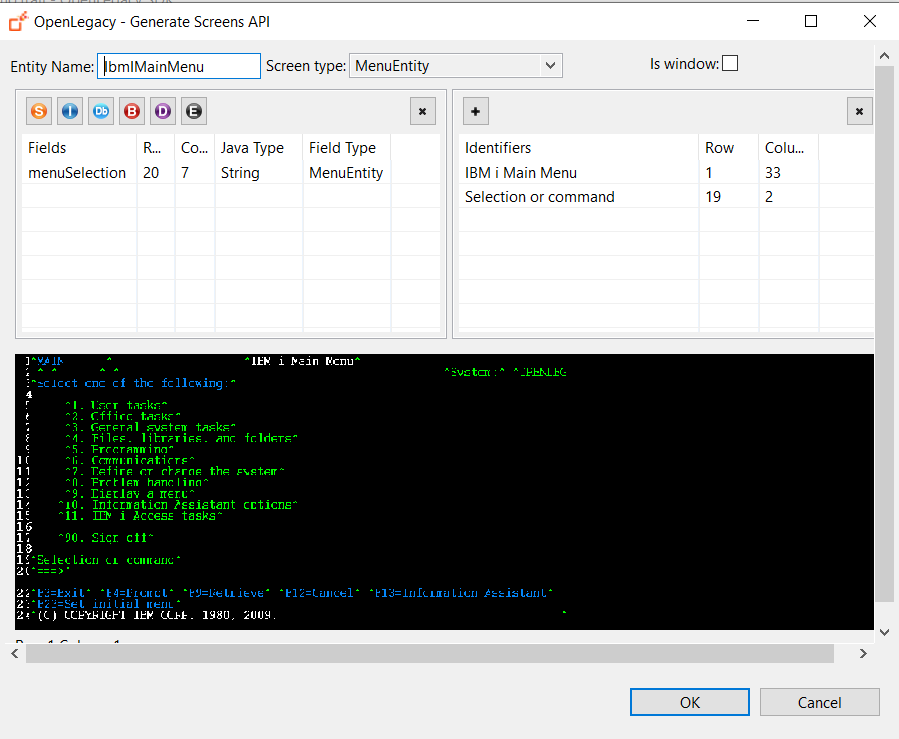

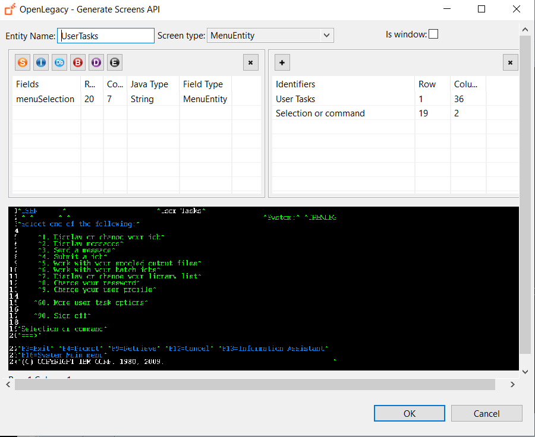


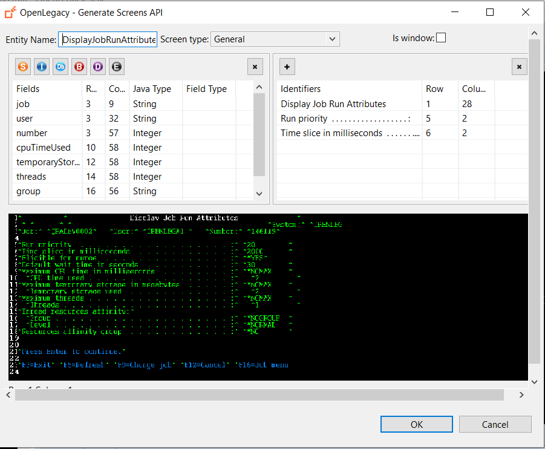


> The entities are created in `src/main/java`.

## STEP 5 - Define Screen navigation
In this step, we will set the navigation metadata for each screen so the SDK will be able to navigate to the relevant screen automatically whenever we would like to fetch it.
In run-time, when the application starts, OpenLegacy builds a tree representing the navigation between all the entities.

1. Open **SignOn.java** class with the **Entity editor**
   1. Go to `General tab → @ScreenNavigation`
        - Select `F12` in the **Exit action** attribute
   2. Save. 
 
   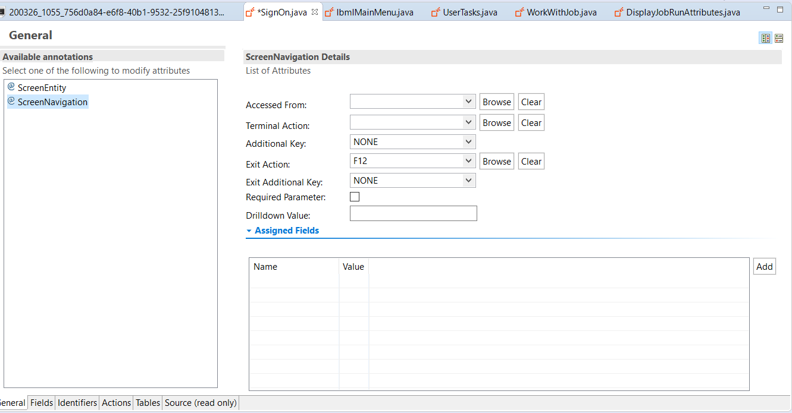 
 
2. Open IbmIMainMenu.java class with the Entity editor
   1. Go to `General tab → @ScreenNavigation`
      - Select `SignOn` in the **Accessed from** attribute
      - Select `ENTER` in **terminal action**
      - Select `F12` as the **Exit action** attribute
   2. Go to `Fields tab → menuSelection` 
      - Change the **End column** attribute to `79`
   3. Save
   
   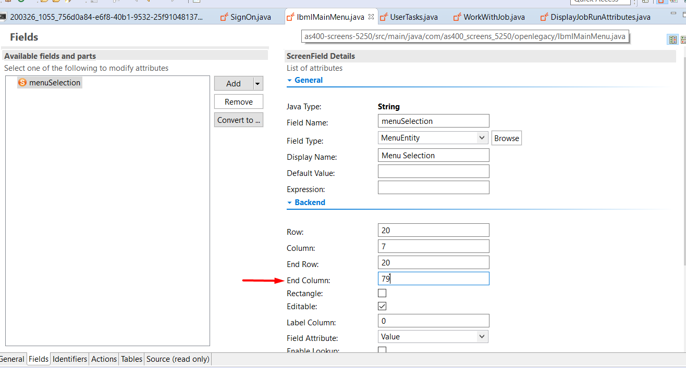 
   
  3. Open UserTasks.java class with the Entity editor
     1. Go to `General tab → @ScreenNavigation`
         - Select `IbmIMainMenu` in the **Accessed from** attribute
         - Select `ENTER` in **terminal action**
         - Select `F12` in the **Exit action** attribute
      2. Go to `Fields tab → menuSelection`
          - Change the **End column** attribute to `79`
      3. Save. 
       
        
  4. Open WorkWithJob.java class with the Entity editor
       1. Go to General `tab → @ScreenNavigation`
          -  Select `UserTasks` in the **Accessed from** attribute
          - Select `ENTER` in **terminal action**
          - Select `F12` in the **Exit action** attribute
       2.  Go to `Fields tab → menuSelection`
           - Change the **End column** attribute to `79`    
       3. Save. 
     
     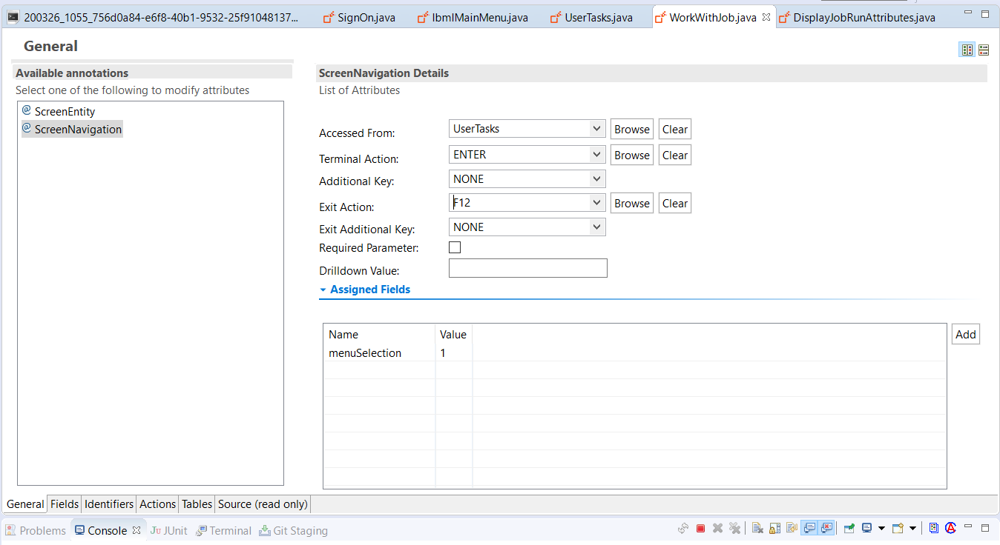
  5. Open DisplayJobRunAttributes.java class with the Entity editor
      1. Go to General `tab → @ScreenNavigation`
         - Select `WorkWithJob` in the **Accessed from**     attribute
         - Select `ENTER` in **terminal action**
         - Select `F12` in the **Exit action** attribute  
      2. Save. 
      
        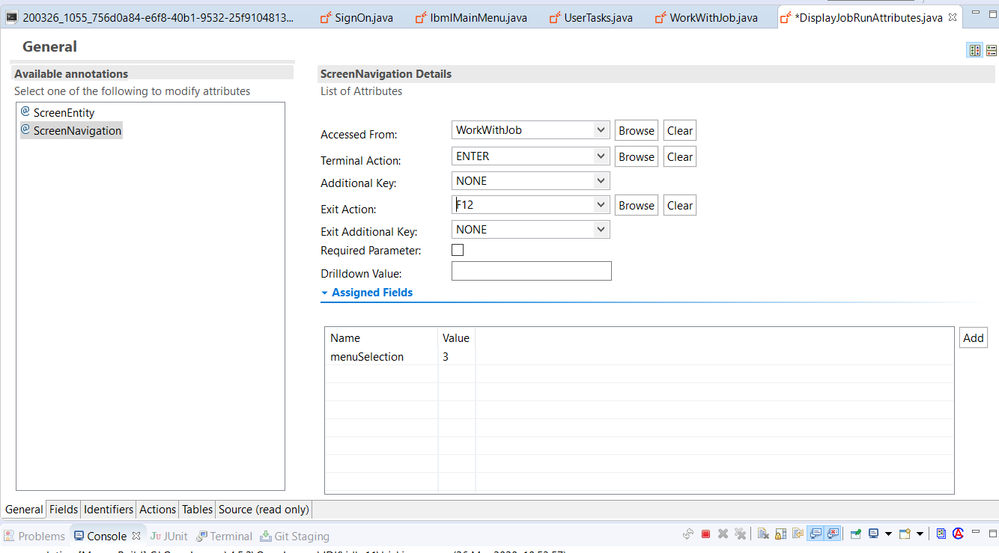
      
## Step 6 - create Junit test
By default, when generating a Java model (entity), a JUnit test is automatically generated.
 - Open **_[trail_name]Test.java** located at `/as400-5250-sdk/src/test/java/tests/`
 - Replace lines:
	```JAVA
	SignOn signOn = terminalSession.getEntity(SignOn.class);
    assertNotNull(signOn);
	```
	with:
	```JAVA
	terminalSession.getModule(Login.class).login("OPENLEGA1", "OPENLEGA");
	```
 - Click `ctrl + shift + o` to add missing imports
 > Make sure all previous programs are terminated
 - Right click  → Run as JUnit test.  
If you followed all the steps above You'll have a working JUnit test.
>_note_ you can add the following to your .YML to see the screens flow. 
```
logging:
  level:
    org:
      openlegacy: debug

```

## Step 7 - create API from SDK
1. Open the New Project Wizard:
   - File → New → OpenLegacy API Project
   - Define the **project name** as `as400-5250-api`.
   - Click at the **Default Package** field, to    automatically fill it up.
   - Press Next and add the SDK project that was created in **Step 1** as the reference project.
2. Generate API from SDK:
   - Right click on the API project and navigate to Openlegacy → Generate API from SDK
   - Define the Service name `DisplayJobAttributes`.
   - At **output**, expand `as400-5250-sdk` and add `DisplayJobRunAttributes` model as an output.
   - Click **OK**.
3. Go to `/as400-5250api/src/main/java/com/as400_5250_api/openlegacy/services` 
   - Right click on **DisplayJobRunAttributesServiceImpl.java** -> Open With -> Java Editor
   
   -  In the **try block**, replace the following lines:
      ```JAVA
			/* autogenerated - execution block start */;
            DisplayJobRunAttributes displayJobRunAttributes = new DisplayJobRunAttributes();
            as4005250SdkSession.doAction(ActionUtil.getScreenAction(DisplayJobRunAttributes.class), displayJobRunAttributes);
      ```
      With the following:
      ```java
			/* autogenerated - execution block start */;
            as4005250SdkSession.getModule(Login.class).login("OPENLEGA1", "OPENLEGA");
            DisplayJobRunAttributes displayJobRunAttributes = new DisplayJobRunAttributes();
            displayJobRunAttributes = as4005250SdkSession.getEntity(DisplayJobRunAttributes.class);
       ```
    
     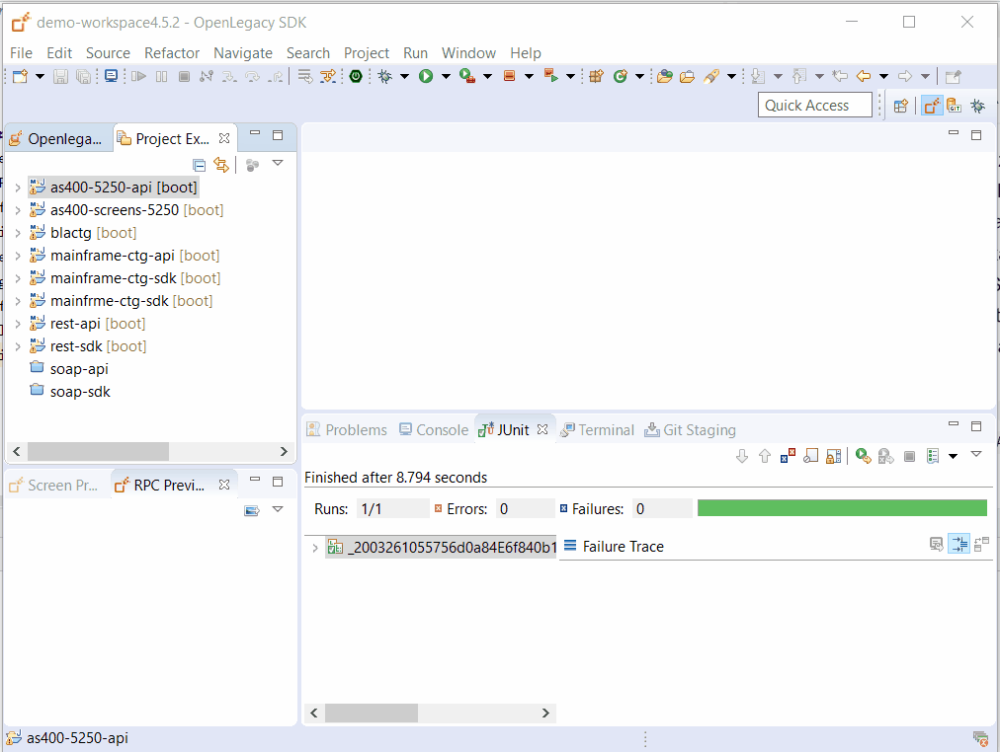

4. Open pom.xml located at **as400-5250-api** project
- Delete lines:
 ```JAVA
        <dependency>
            <groupId>org.openlegacy</groupId>
            <artifactId>openlegacy-api-logging</artifactId>
            <version>${openlegacy.version}</version>
        </dependency>
 ```
- Save.

 ## Step 8 - Run and Test your API
 1. **Right-Click** on the **as400-5250-api** project → OpenLegacy → Run Application
 2. Open the browser on http://localhost:8080/swagger
 3. Authorize through **Oauth2**
   - **Client Id:** `client_id`
   - **Client Secret:** `client_secret`
 4. Click on the API we've created → Try it out
 
    - You should see successful respond returned directly from the AS/400 program!
```json
     {
       "displayJobRunAttributes": {
         "job": "QPADEV0002",
         "user": "OPENLEGA1",
         "number": 146192,
         "cpuTimeUsed": 7,
         "temporaryStorageUsed": 2,
         "threads": 1,
         "group": "*NOGROUP",
         "level": "*NORMAL",
         "focusField": null
       }
     }
```

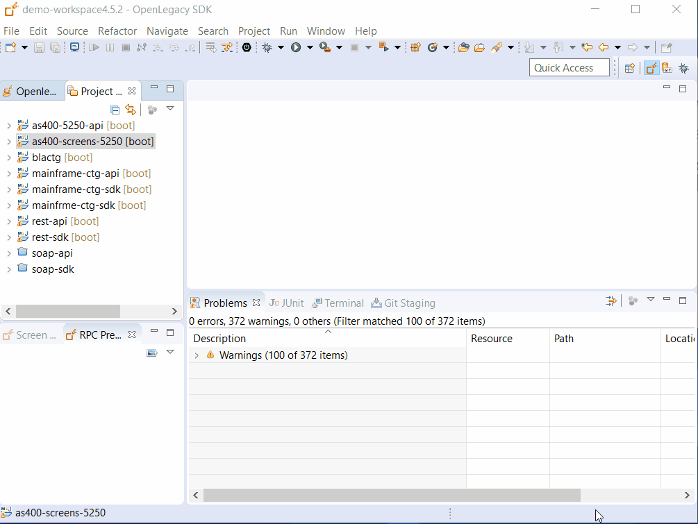

## Summary

In this demo, we have presented an end to end integration with **AS/400 Screens** using Openlegacy IDE within just a couple of minutes. We have started from the recording of a trail file using the Openlegacy Emulator, from the trail file we have automatically generated Java SDK that enables us to navigate through the AS/400 Screens in order to receive meaningful data from your destined Screen. In addition we have presented the creation of a REST API utilizing the AS/400 Screens SDK.
We used the IDE to better model and design the API and showed how it works with a standard Swagger page.
