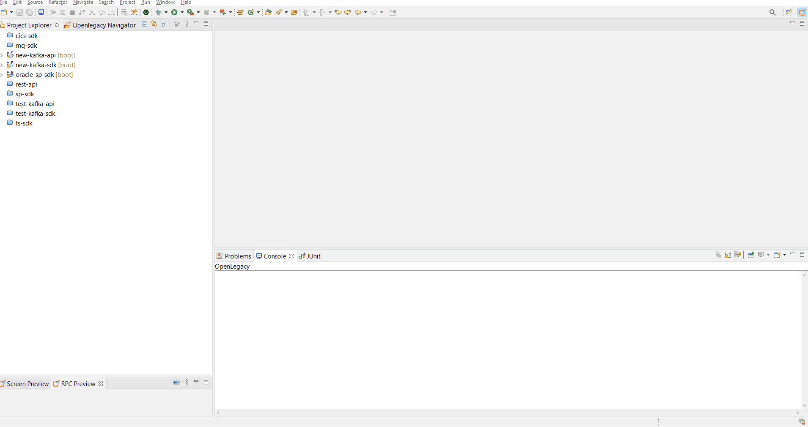
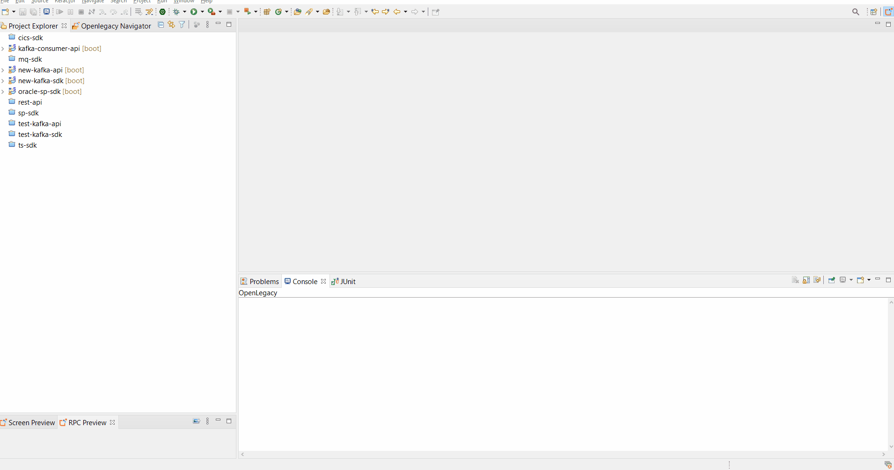
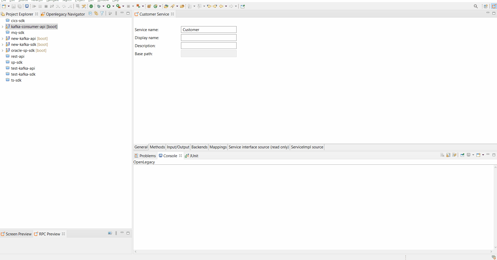

# Demo-Kafka-Consumer

## Pre-Requirements

- Openlegacy IDE 4.6.9 (Full installation including JDK 11 and all Maven dependencies).
- Internet Connection.
- OpenLegacy SDK (e.g. mainFrame cics ts itemdet please use cics-ts-sdk from sample-project folder)
- Basic knowladge of Kafka.
- Kafka CLI.

## Demo Definition

- Create Kafka consumer project on top of SDK project.
- Generate Kafka consumer and producer from SDK.
- Consume and produce messages with Openlegacy Kafka consumer.

## Demo resources

- `oracle-sp-sdk` from sample-project folder - as backend.
- Full tutorial on making the - [oracle-sp-sdk](https://github.com/openlegacy/demo-oracle-stored-procedures)

## Step 1 - Create Kafka consumer

> First, import the attached SDK `oracle-sp-sdk` into your workspace. The purpose of the Kafka consumer is to consume the input from one topic and produce the response from the SDK into another topic.

1. Open new API project wizard:
   - File → New OpenLegacy → API Project.
2. Define the **Project Name** as `kafka-consumer-api` .
3. Click the **Default Package** field, to automatically fill it up.
4. Select Kafka Consumer as **Service Type** and click Next.
5. Set the kafka configurations:
   - **Kafka server's Host/IP** : http://kafka-sandbox.openlegacy.com:9092
   - **Group ID** : OpenLegacy
   - **Error Handdling** : Commit
     > **Error Handling options:**  
     >  _Commit_ - Ignore Errors, the consumer will proceed to the next message.  
     > _Reprocess_ - Messages will be processed until they are successful.  
     > _Dead letter queue_ - Failed messages will move to a different topic and the consumer will proceed to the next message.
6. Next.
7. Select `oracle-sp-sdk` as a reference project, and Finish.



## Step 2 - Generate Kafka consumer from SDK

1.  Right-click on **kafka-consumer-api** project → OpenLegacy → Generate API from SDK.
2.  Name the Service `Customer`.
3.  Select from the `GetAccountById` model the `accId` as input.
4.  Select `GetAccountById` model as output.
5.  Click on **configurations**:

    - Define the consumer topic as: `customerIn`
    - Check the _Generate Producer_ checkbox.
    - Define the producer topic as: `customerOut`
    - Click OK.



## Step 3 - Produce input and consume the SDK’s output from another topic

1. Right-click on **kafka-consumer-api** project → OpenLegacy → Run Application.
2. Open CMD and produce the input in a JSON format.

```
PS C:\Users\user> kafka-console-producer --broker-list kafka-sandbox.openlegacy.com:9092 --topic customerIn
>{"accId": "61"}
```

3. Open another CMD and consume the SDK response from the producer topic

```
PS C:\Users\user>  kafka-console-consumer --bootstrap-server kafka-sandbox.openlegacy.com:9092 --topic customerOut --from-beginning
{"statusCode" : "200","account" : {"accountId" : "61","accountNumber" : "3535899739559196","fullName" : "Ray Buckthorp","email" : "rbuckthorp1o@dedecms.com","iban" : "FO89 2800 2832 7492 80","creditCardType" : "jcb","accCurrencyCode" : "BSD","balance" : "-6048780.05","creattionDate" : "1992-05-01 12:00:00"}}
```


