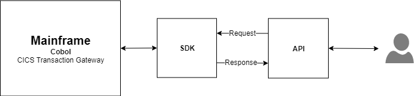
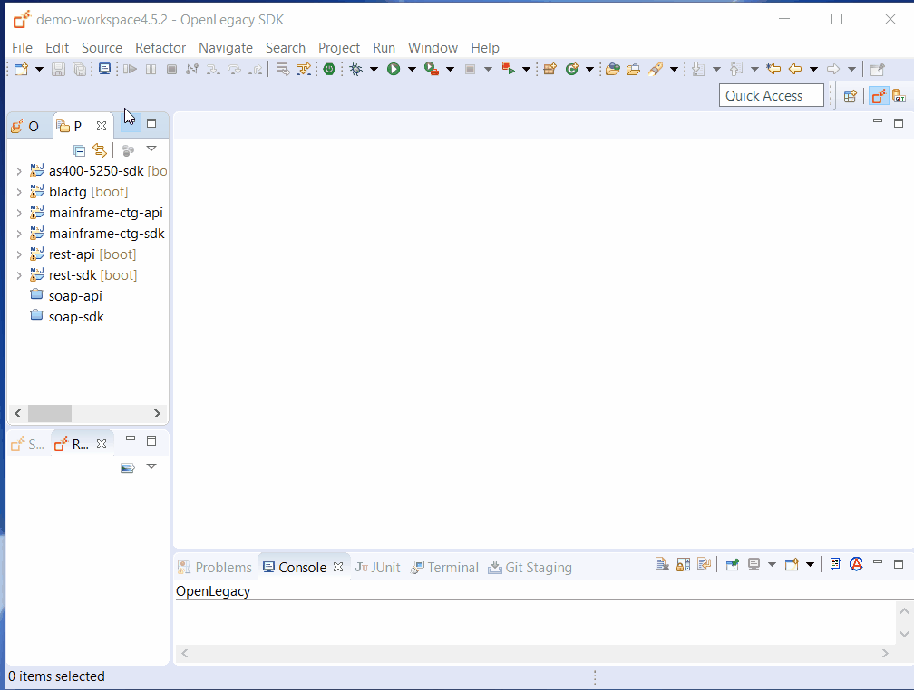
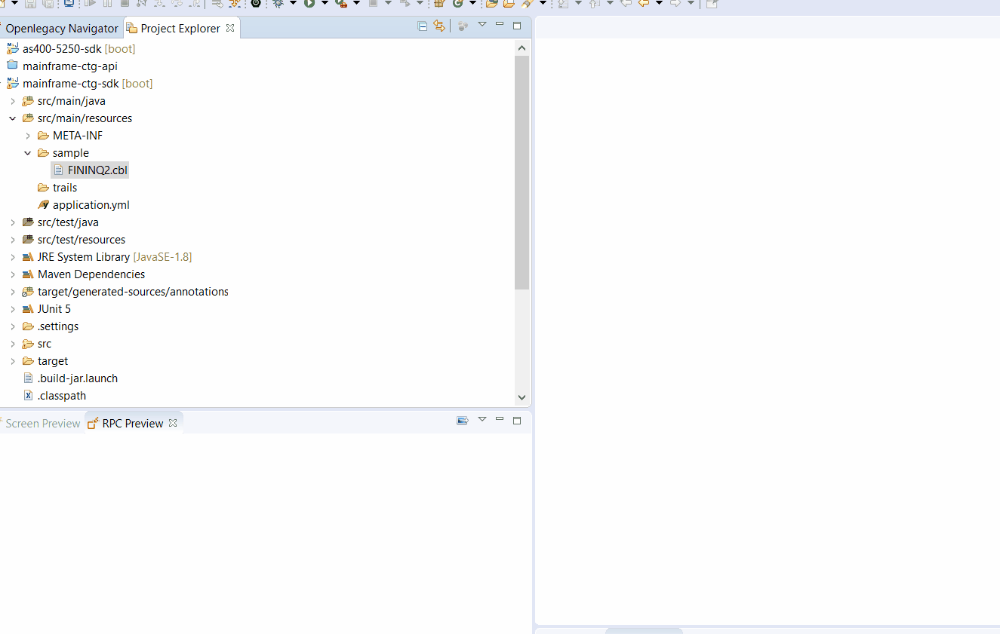
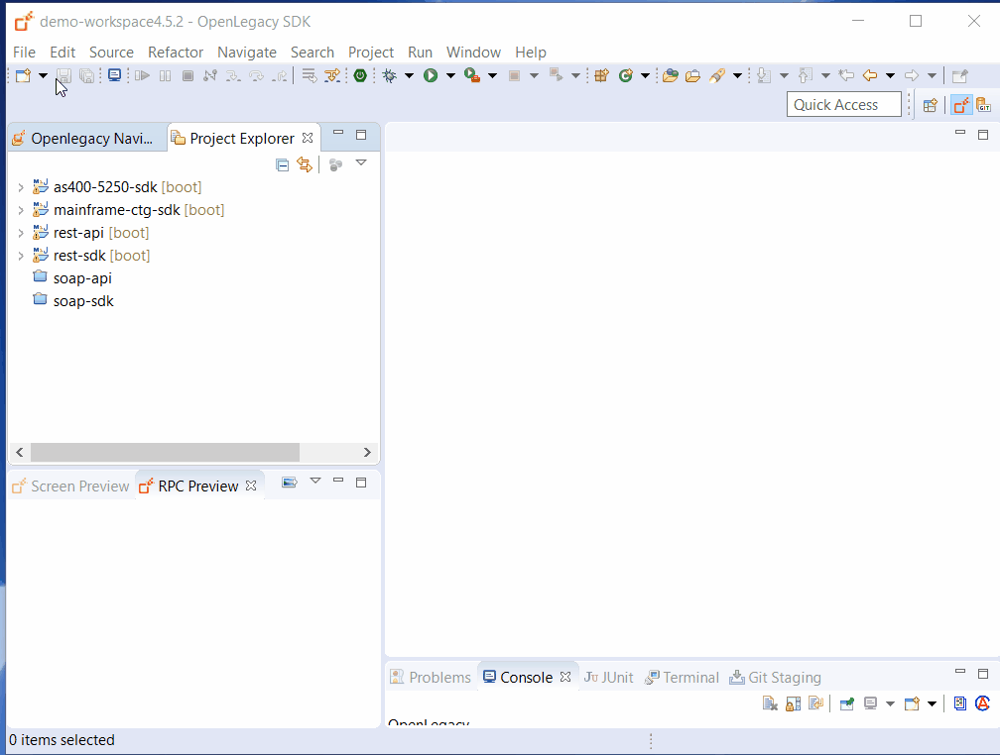
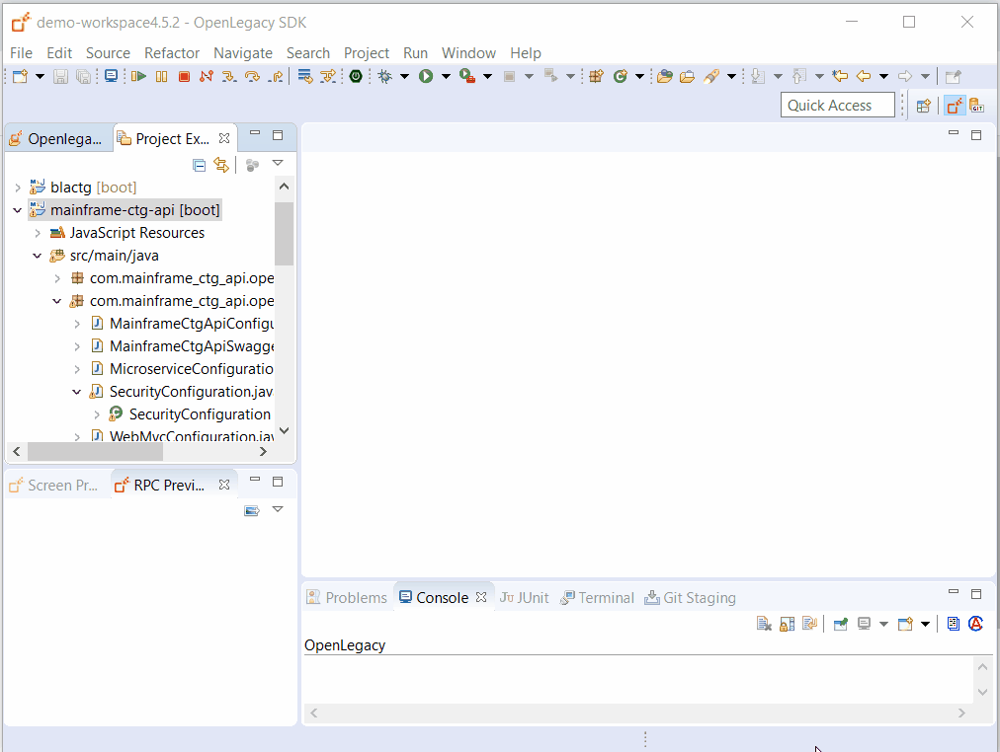

# Mainframe CICS Transaction Gateway (CTG) Demo

## Introduction

The following demonstrate how to create an API for retrieval of customer credit cards by forwarding the request to an underlying CICS program using the OpenLegacy CTG connector.

## Architecture



## Pre-Requirements

- OpenLegacy IDE 4.6.5 (Full installation including JDK and all Maven dependencies)
- Internet Connection

## Demo Resources

- [FININQ2.cbl](./assets/resources/FININQ2.cbl) - COBOL Program

## Demo Definition

- Create a new SDK Project.
- Generate Java model (Entity) from COBOL source file.
- Develop unit tests on the fly.
- Test the connectivity and data retrieval from the **Mainframe CICS**.
- You will use JUnit tests to test the SDK and invoke the response.
- Creation of an API Project on the top of your SDK Project.

## Step 1 – Create a New SDK Project

> First we will create a new SDK project using the OpenLegacy IDE.
The purpose of the SDK project is to allow easy access to legacy backends, using standard and easy to use Java code.

1. Open the New Project Wizard:
   - File → New → OpenLegacy SDK Project
2. Define the **Project Name** as `mainframe-ctg-sdk`.
3. Click at the **Default Package** field, to automatically fill it up.
4. Select **Mainframe CICS TG** as the backend and click Next.
5. Enter the Mainfraime CTG connection details:
   - **Host Name/IP:** `192.86.32.238`
   - **Host Port:** `13200`
   - **Code Page:** `CP037`
6. Click **Finish**.
7. Go to `src/main/resourse/application.yml` and define the  `default-ipic-server` as `IPCSSL`
   ```yaml
      hostname: 192.86.32.238
      port: 13200
      code-page: CP037
      username: 
      password: 
      default-ipic-server: IPCSSL
   ```



## Step 2 – Generate Java Model (Entity) From COBOL File

> Now, we will create Java models out of a COBOL source file of the program we wish to expose.

1. Right click on `src/main/resources` → New → Folder to create a new folder. The folder name should be `sample`.
2. Copy `FININQ2.cbl` to `src/main/resources/sample` folder.
3. Right click on the `FININQ2.cbl` file → OpenLegacy → Generate Model.
4. In the **Execute Path** field, write `FININQ2`.
5. Check **Generate JUnit Test** checkbox.
6. Click **OK**.
 > **_NOTE:_** the transaction Id is an optional field that allows you to invoke a program through existing transactions, like your custom logger.

   
## Step 3 – Create a JUnit Test

>By default, when generating a Java model (entity), a JUnit test is automatically generated.
>We can extend this test suite with additional unit tests to validate our connectivity to the backend.

1. Open the generated mock at `src/test/resources/mock/test_fininq2Test_usecase_1.input.json`
2. Define the `custId` as `412-83254`.
3. Open the generated JUnit test at `src/test/java/tests/Fininq2Test.java`, highlight the second test and run the JUnit by Right Clicking on `Fininq2` → Run As → JUnit Tests.
  If you followed all the steps correctly you should receive the following response returned directly from the Mainframe:
   ```json
   {
     "dfhcommarea" : {
       "custId" : "412-83254",
       "creditCards" : [ {
         "cardNumber" : "4580123412341234",
         "cardType" : "GOLD",
         "cardLimit" : 5000,
         "cardUsage" : 1783
       }, {
         "cardNumber" : "4580002377826452",
         "cardType" : "PLATINUM",
         "cardLimit" : 10000,
         "cardUsage" : 567
       }, {
         "cardNumber" : "4580887386255265",
         "cardType" : "BUSINESS-G",
         "cardLimit" : 7000,
         "cardUsage" : 4873
       }, {
         "cardNumber" : "4580108372533424",
         "cardType" : "BASIC",
         "cardLimit" : 1000,
         "cardUsage" : 0
       }, {
         "cardNumber" : "4580773685986244",
         "cardType" : "FT-MEMBER",
         "cardLimit" : 2000,
         "cardUsage" : 600
       } ]
     }
   }
   ```
 4. Copy the response to `src/test/resources/mock/Fininq2Test/test_fininq2Test_usecase_1.output.json`
 5. Run the JUnit test again.

## Step 4 - Create an API from SDK

1. Open the New Project Wizard:
   - File → New → OpenLegacy API Project
2. Define the project name as `mainframe-ctg-api`.
3. Click at the **Default Package** field, to automatically fill it up.
4. Press Next and add the `mainframe-ctg-sdk` SDK project that was created in **Step 1**  as the reference project.

 
 
5. Right click on the `mainframe-ctg-api` project and navigate to Openlegacy → Generate API from SDK.
   - Name the service `Cards`
   - Select from the `Fininq2` model the `custId`.
   - Select `creditCards` model as output.
   - Click **OK**.


## Step 5 - Run and Test your API

1. **Right-Click** on the `mainframe-ctg-api` project → OpenLegacy → Run Application
2. Open the browser on http://localhost:8080/swagger
3. Authorize through **Oauth2**
   - **Client Id:** `client_id`
   - **Client Secret:** `client_secret`
4. **Click** on the API we've created → Try it out
   - Set the value for `custId` as `412-83254`.
   - You should see successful respond returned directly from the Mainframe CICS program `FININQ2`!
     ```json
     {
       "creditCards": [
         {
           "cardNumber": "4580123412341234",
           "cardType": "GOLD",
           "cardLimit": 5000,
           "cardUsage": 1783
         },
         {
           "cardNumber": "4580002377826452",
           "cardType": "PLATINUM",
           "cardLimit": 10000,
           "cardUsage": 567
         },
         {
           "cardNumber": "4580887386255265",
           "cardType": "BUSINESS-G",
           "cardLimit": 7000,
           "cardUsage": 4873
         },
         {
           "cardNumber": "4580108372533424",
           "cardType": "BASIC",
           "cardLimit": 1000,
           "cardUsage": 0
         },
         {
           "cardNumber": "4580773685986244",
           "cardType": "FT-MEMBER",
           "cardLimit": 2000,
           "cardUsage": 600
         }
       ]
     }
     ```



## Summary

In this demo we have presented an end to end integration with Mainframe CICS using Openlegacy IDE within just a couple of minutes. We have started from a COBOL source of a program we wanted to expose and automatically generated Java SDK that enables calling the underlying program, then we have presented the creation of a REST API utilizing the Mainframe CICS CTG SDK. We used the IDE to better model and design the API and showed how it works with a standard Swagger page.
