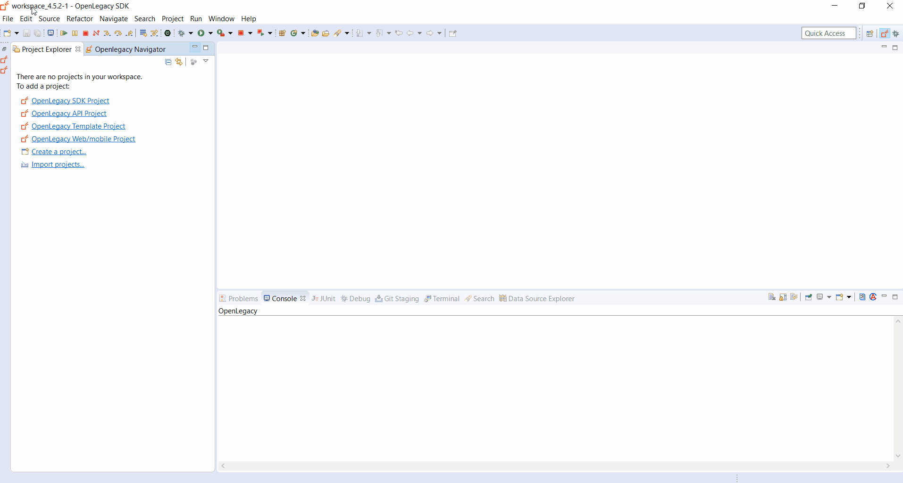
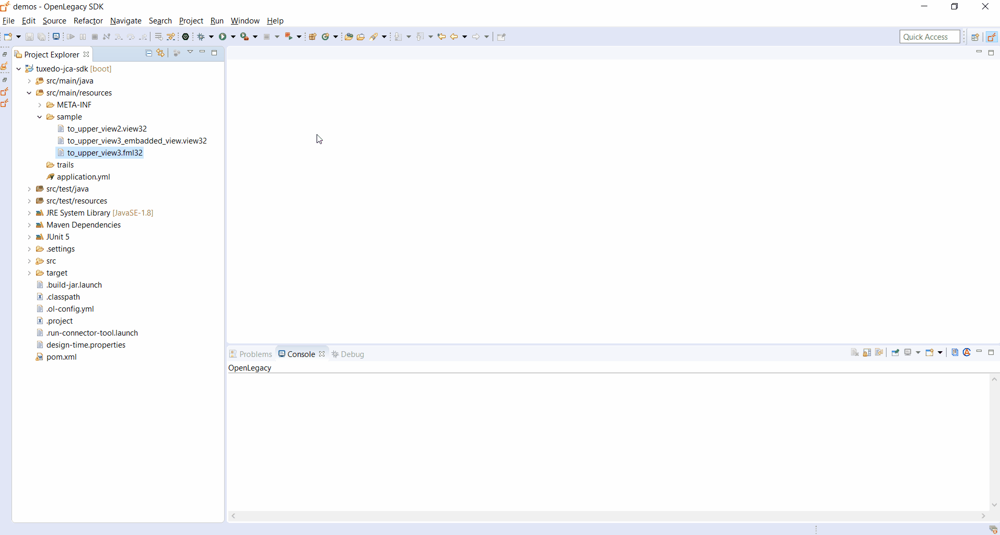
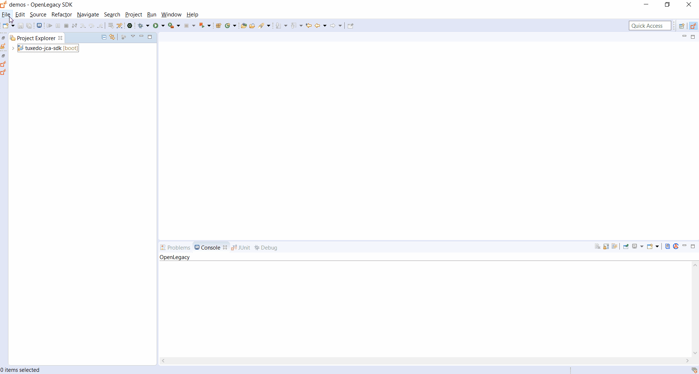
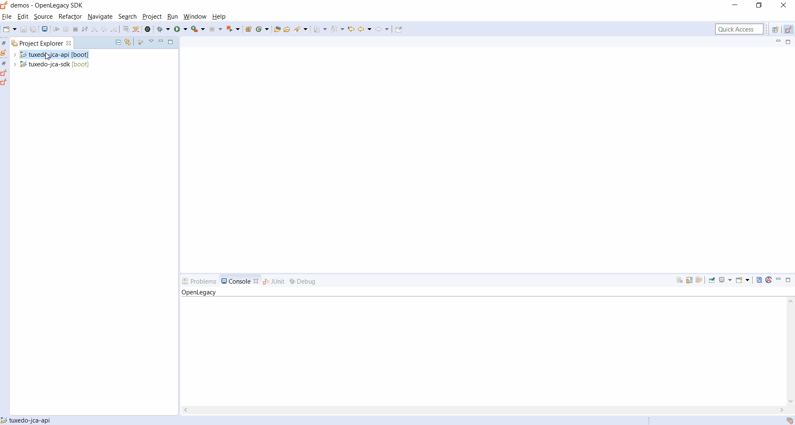

# REST API on top of Tuxedo JCA
 
The following Step by Step Guide demonstrates how to create an API for retrieval of user details by forwarding the request to an underlying Tuxedo program using the OpenLegacy adapter.

## Pre-Requirements

- OpenLegacy IDE  (Full installation including JDK and all Maven dependencies).
- Internet Connection

## Demo Definition 

- Creation of a new SDK Project.
- Generating Java Entities from a Tuxedo service.
- Develop and run unit tests on the fly.
- Test the connectivity and data retrieval from the **Tuxedo Service**.
- Creation of an API Project on the top of your SDK Project.

## Demo Resources

- [to_upper_view2.view32](./assets/resources/to_upper_view2.view32)
- [to_upper_view3.fml32](./assets/resources/to_upper_view3.fml32)
- [to_upper_view3_embadded_view.view32](./assets/resources/to_upper_view3_embadded_view.view32)

## Step 1 – Create a New SDK Project

> First, we will create a new SDK project using the OpenLegacy IDE.
The purpose of the SDK project is to allow easy access to legacy backends, using standard and easy to use Java code.

1. Open the New Project Wizard:
   - File → New → OpenLegacy SDK Project
2. Define the **Project Name** as **tuxedo-jca-sdk**
3. Click at the **Default Package** field, to automatically fill it up.
4. Select **Tuxedo JCA** as the backend and click **Next**
5. Set the connection details to the backend based on following parameters:
    - **Local Access Point:** `//3.212.126.138:12001/domainId=REMOTE_01`
    - **Remote Access Point:** `//3.212.126.138:12001/domainId=LOCAL_01`
6. Click **Finish**



## Step 2 – Generate Java Model (Entity) from the Tuxedo service

1. Copy all the Demo Resources to `src/main/resources/sample`
2. **Right-Click** on the `to_upper_view2.view32` file → OpenLegacy → Generate Model
3. Set **Service name**: `TOUPPERVIEW2`
4. Set **Input view**: `MYVIEWS`
5. Set **Output view**: `MYVIEWR`
6. Check the **Generate JUnit Test checkbox**
7. Click **OK**
8. **Right-Click** on the `to_upper_view3.fml32` file → OpenLegacy → Generate Model
9. Set **Service name**: `TOUPPERVIEW3`
10. Set **View file**: `to_upper_view3_embadded_view.view32`
11. Check the **Generate JUnit Test checkbox**
12. Click **OK**


## Step 3 – Create a JUnit Test

> OpenLegacy enables test-driven development by auto-generating test suites for each backend program (entities).
The tests are auto-generated, and all you have to do is to provide a JSON format input and output to test against the backend.

1. Open `src/test/resources/mock/FmlEntityTest/test_fmlEntityTest_usecase_1.input.json` and paste the following JSON:
   ```json
   {
     "sval1" : 0,
     "sval2" : 0,
     "lval1" : 0,
     "lval2" : [ 0 ],
     "lval3" : 0,
     "mystr1" : "",
     "mystr2" : "",
     "osval1" : 0,
     "osval2" : 0,
     "olval1" : 0,
     "olval2" : [ 0 ],
     "omystr10" : [ "" ],
     "sval10" : 0,
     "lval10" : 9,
     "lval11" : 1560002649,
     "mystr10" : "",
     "myView" : {
       "i" : 3,
       "i1" : [ 1111, 2222, 3333, 4444, 5555, 6666 ],
       "s" : "hello world from B"
     }
   }
   ```
2. Open `src/test/resources/mock/FmlEntityTest/test_fmlEntityTest_usecase_1.output.json` and paste the following JSON, this is the expected output:
   ```json
   {
     "sval1" : 0,
     "sval2" : 0,
     "lval1" : 0,
     "lval2" : [ 0 ],
     "lval3" : 0,
     "mystr1" : "",
     "mystr2" : "",
     "osval1" : 0,
     "osval2" : 0,
     "olval1" : 0,
     "olval2" : [ 9, 1560002649, 3, 1111, 2222, 3333 ],
     "omystr10" : [ null, null, "Hello World #3", null, null, null, "Hello World #1", null, "Hello World #2", null ],
     "sval10" : 0,
     "lval10" : 9,
     "lval11" : 1560002649,
     "mystr10" : "",
     "myView" : {
       "i" : 3,
       "i1" : [ 1111, 2222, 3333, 4444, 5555, 6666 ],
       "s" : "hello world from B"
     }
   } 
   ```
3. Open `src/test/resources/mock/ViewEntityTest/test_viewEntityTest_usecase_1.input.json` and paste the following JSON:
   ```json
   {
     "myviews" : {
       "sval" : 22,
       "lval" : 11,
       "szStr1" : "test",
       "szStr2" : ""
     }
   }
   ```
4. Open `src/test/resources/mock/ViewEntityTest/test_viewEntityTest_usecase_1.output.json` and paste the following JSON, this is the expected output:
   ```json
   {
     "myviews" : {
       "sval" : 22,
       "lval" : 11,
       "szStr1" : "test",
       "szStr2" : ""
     },
     "myviewr" : {
       "sval" : 122,
       "lval" : 1011,
       "szStr1" : "TEST"
     }
   } 
   ```
5. Run the JUnit by Right Clicking on **tuxedo-jca-sdk** → Run As → JUnit Test.
   If you followed all the steps correctly the tests should pass.


    
## Step 4 – Create APIs from SDK

1. Open the New Project Wizard:
   - File → New → OpenLegacy API Project
2. Define the **Project name** as `tuxedo-jca-api`.
3. Click on the **Default Package** field to automatically fill it up.
4. Make sure `REST API` is selected as the **Service Type** (selected by default)
5. Press Next and add the SDK project that was created in **Step 1**  as the reference project.
6. **Right-Click** on the **tuxedo-jca-api** project → OpenLegacy → Generate API from SDK
    - Name the service `ViewEntity`
    - Select from the `ViewEntity` model the `sval` `lval` and `szStr1` field as input.
    - Select the `myviewr` model as output
    - **Click OK**

7. **Right-Click** on the **tuxedo-jca-api** project → OpenLegacy → Generate API from SDK
    - Name the service `FmlEntity`
    - Select from the `FmlEntity` model the `lval10` `lval11` and `myView` field as input.
    - Select the `myviewr` model as output
    - **Click OK** 
    



## Step 5 - Run and Test your API

1. **Right-Click** on the **tuxedo-jca-api** project → OpenLegacy → Run Application
2. Open the browser on http://localhost:8080/swagger
3. Authorize through **Oauth2**
   - **Client Id:** `client_id`
   - **Client Secret:** `client_secret`
4. **Click** on the `FmlEntity` API we've created → Try it out
    - Set the following input:
      ```json
      {
        "lval10": 9,
        "lval11": 1560002649,
        "myView": {
          "i": 3,
          "i1": [
            1111, 2222, 3333, 4444, 5555, 6666
          ],
          "s": "hello world from B"
        }
      }
      ```
4. Click execute.
5. **Click** on the `ViewEntity` API we've created → Try it out
    - Set the following input:
      ```json
      {
          "sval" : 22,
          "lval" : 11,
          "szStr1" : "test"
      }
      ```      



## Summary

In this demo we have presented an end to end integration with Tuxedo JCA using Openlegacy IDE within just a couple of minutes.
We have started from a FML source of a program we wanted to expose and automatically generated Java SDK that enables calling the underlying program, using Tuxedo JCA, then we have presented the creation of a REST API utilizing the Tuxedo JCA SDK.
We used the IDE to better model and design the API and showed how it works with a standard Swagger page.
        
