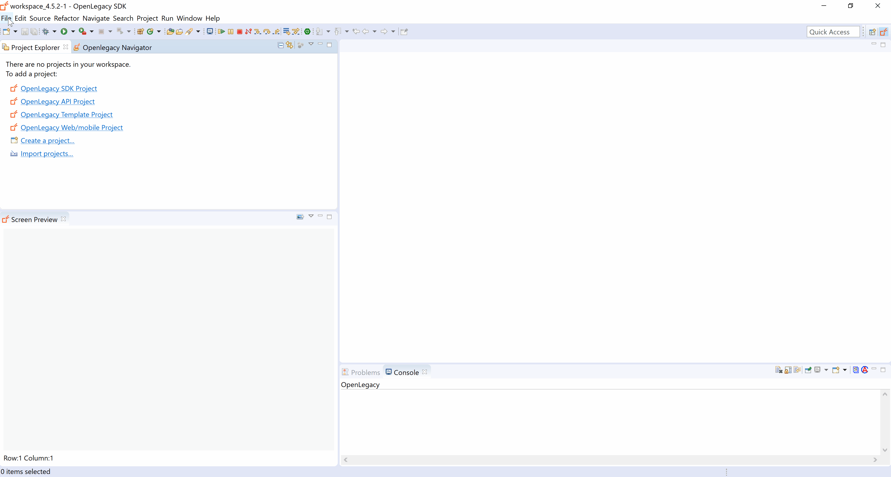
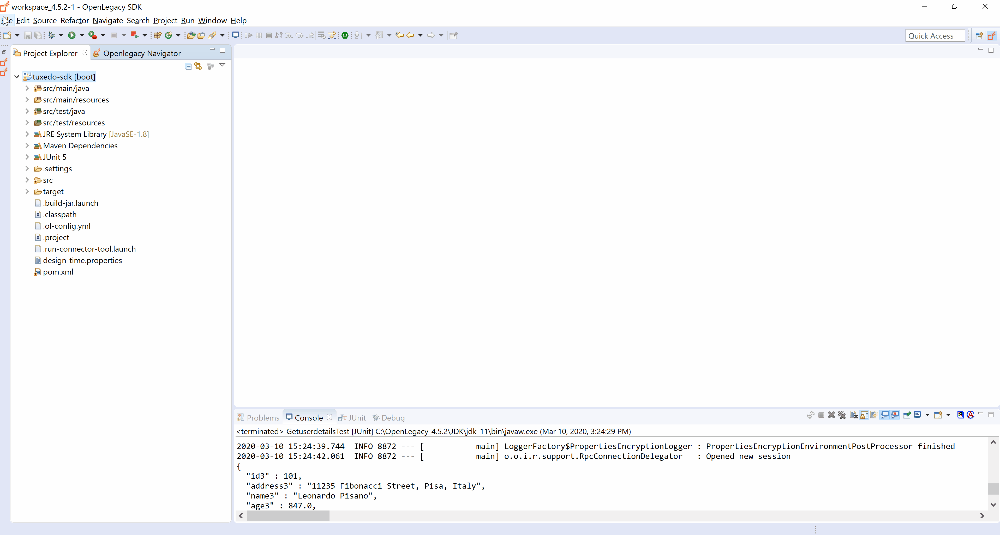
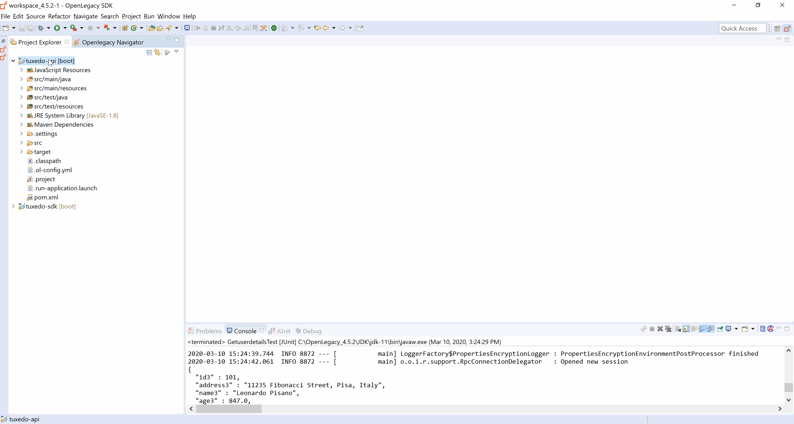
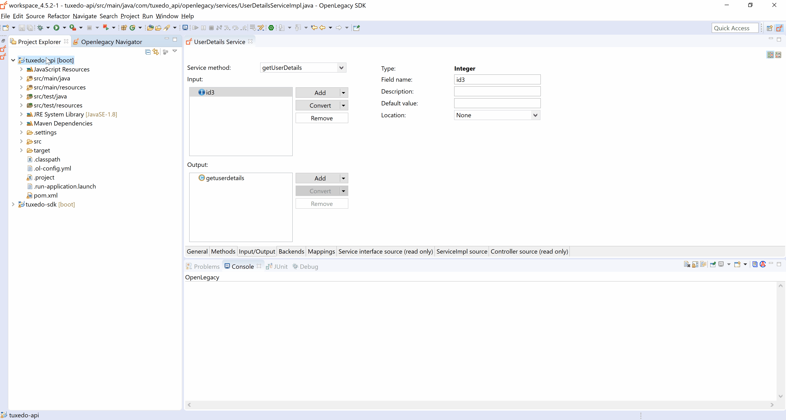

# REST API on top of Tuxedo Jolt

The following Step by Step Guide demonstrates how to create an API for retrieval of user details by forwarding the request to an underlying Tuxedo program using the OpenLegacy adapter.


## Pre-Requirements

- OpenLegacy IDE 4.6.12 (Full installation including JDK and all Maven dependencies).
- Internet Connection

## Demo Definition

- Creation of a new SDK Project.
- Generating Java Entities from a Tuxedo service.
- Develop and run unit tests on the fly.
- Test the connectivity and data retrieval from the **Tuxedo Service**.
- Creation of an API Project on the top of your SDK Project.

## Step 1 – Create a New SDK Project

> First, we will create a new SDK project using the OpenLegacy IDE.
The purpose of the SDK project is to allow easy access to legacy backends, using standard and easy to use Java code.

1. Open the New Project Wizard:
   - File → New → OpenLegacy SDK Project
2. Define the **Project Name** as **tuxedo-sdk**
3. Click at the **Default Package** field, to automatically fill it up.
4. Select **Tuxedo JOLT** as the backend and click **Next**
5. Set the connection details to the backend based on following parameters:
    - **App Address:** `//tuxedo.openlegacy.org:8001`
    - **App Password:** `Leave blank`
    - **User:** `Leave blank`
    - **Password:** `Leave blank`
    - **User Role** `Leave blank`
6. Click **Finish**



## Step 2 – Generate Java Model (Entity) from the Tuxedo service

1. **Right-Click** on the project -> `OpenLegacy` -> `Import Tuxido Service Definition`
2. Set the source properties based on following parameters:
    - **Host Name/IP:** `//tuxedo.openlegacy.org:8001`
    - **App password:** `Leave blank`
    - **Service Name:** `GETUSERDETAILS`
    - **User:** `Leave blank`
    - **Password:** `Leave blank`
    - **User Role:** `Leave blank`
3. Check the **Generate JUnit Test checkbox**
4. Click **OK**

## Step 3 – Create a JUnit Test

> OpenLegacy enables test-driven development by auto-generating test suites for each backend program (entities).
We can extend this test suite with additional unit tests to validate our connectivity to the backend.

1. Go to `src/test/java/tests/GetuserdetailsTest.java` 
2. Add a PrintJson method to print the response retrieved from the backend:
     ```java
     public static void printJson(Object object) {
        ObjectMapper mapper = new ObjectMapper();
        mapper.configure(SerializationFeature.INDENT_OUTPUT, true);
        try {
            System.out.println(mapper.writeValueAsString(object));
        } catch (JsonProcessingException e) {
            System.out.println(e.getMessage());
        }
    } 
    ```
    
    > **_NOTE:_** Press `Ctrl+Shift+O` to automatically organize the imports and add missing classes, choose `fasterxml` instead of `codehaus` for the `ObjectMapper`.

3. Implement a simple unit test to validate connectivity to the Tuxedo service and retrieve user data:
    ```java
    @Autowired
    private RpcSession rpcSession;

    @Test
    public void testGetuserdetailsEXECUTE() throws Exception {
        try {
            Getuserdetails getuserdetails = new Getuserdetails();
            getuserdetails.setId3(101);
            getuserdetails = rpcSession.doAction(RpcActions.EXECUTE(), getuserdetails);
            assertNotNull(getuserdetails);
            assertThat(getuserdetails.getName3().equals("Leonardo Pisano"));
            printJson(getuserdetails);
        } finally {
            rpcSession.disconnect();
        }
    }
     ```
    
4. Run the JUnit by Right Clicking on getUserDetailsEXECUTE() → Run As → JUnit Tests.

    - **The test should pass and the following JSON should be printed:**
     
    ```json   
    {
      "id3" : 101,
      "address3" : "11235 Fibonacci Street, Pisa, Italy",
      "name3" : "Leonardo Pisano",
      "age3" : 847.0,
      "currency3" : 314.0,
      "year3" : 1170,
      "children3" : 3
    }
    ```
    
## Step 4 – Create APIs from SDK
1. Open the New Project Wizard:
   - File → New → OpenLegacy API Project
2. Define the **Project name** as `tuxedo-api`.
3. Click on the **Default Package** field to automatically fill it up.
4. Make sure `REST API` is selected as the **Service Type** (selected by default)
5. Press Next and add the SDK project that was created in **Step 1**  as the reference project.



7. **Right-Click** on the **tuxedo API** project → OpenLegacy → Generate API from SDK
    - Name the service `UserDetails`
    - Select from the `Getuserdetails` model the `id3` field as input.
    - Select the `Getuserdetails` model as output
    - **Click OK**
    


## Step 5 - Run and Test your API

1. **Right-Click** on the **cards API** project → OpenLegacy → Run Application
2. Open the browser on http://localhost:8080/swagger
3. Authorize through **Oauth2**
   - **Client Id:** `client_id`
   - **Client Secret:** `client_secret`
4.  **Click** on the API we've created → Try it out
    - Set dummy customer ID as input (for example: `102`)
    - You should see a successful response returned:
    
        ```json
        {
          "getuserdetails": {
            "id3": 102,
            "address3": "1 Main Street, Hollywood, California",
            "name3": "Mickey Mouse",
            "age3": 89,
            "currency3": 1,
            "year3": 1928,
            "children3": 0
          }
        }
        ```  
        
        
        
